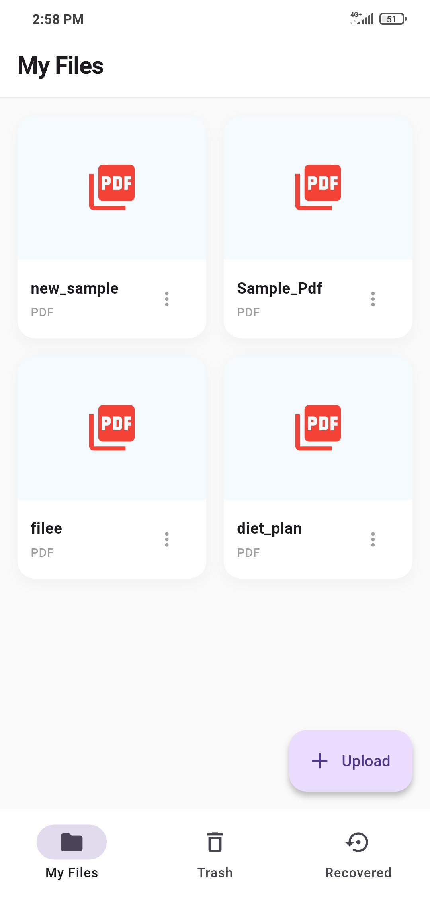
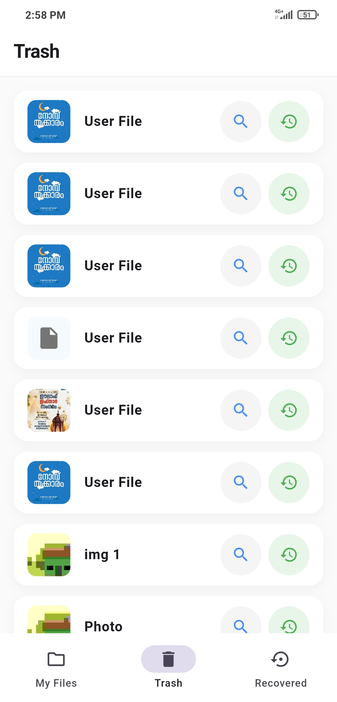
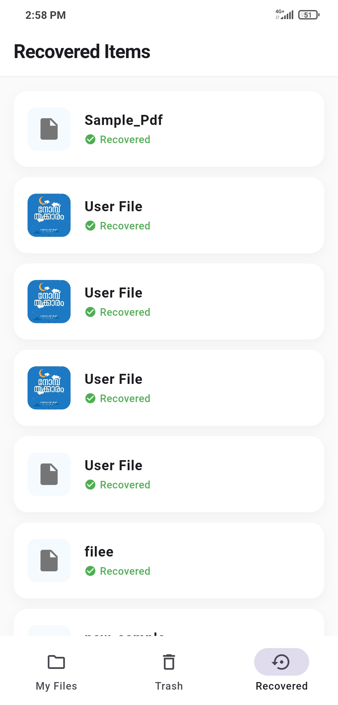
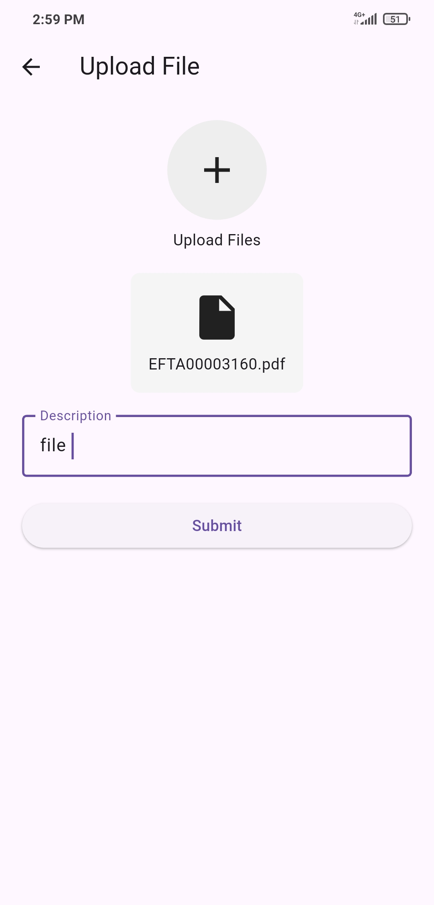

# 📱 Flutter File Manager (CRUD App)

A practical Create, Read, Update, and Delete (CRUD) app built with Flutter during my internship to apply core widget concepts and backend integration. It features file uploads, a grid-based viewing system, and a safe deletion/recovery setup!

## 📸 Screenshots

<p align="center">
  
  &nbsp;&nbsp;
  
  &nbsp;&nbsp;
  
  &nbsp;&nbsp;
  
  &nbsp;&nbsp;
  
  &nbsp;&nbsp;
  
</p>

---

## 🚀 Features

- ✅ **Authentication:** Secure user login into the app.
- ✅ **File Uploads:** Pick and upload images directly from the device.
- ✅ **Gallery View:** View a sleek, organized list of all files displayed as a grid.
- ✅ **Safe Deletion:** Delete specific items with a confirmation prompt to prevent accidental data loss.
- ✅ **Recovery System:** Explore a "recycle bin" style screen where users can recover temporarily deleted items.

---

## 🛠️ Tech Stack & Concepts Applied

| Concept | Usage |
|--------|-------|
| `StatefulWidget` | Managing local and dynamic UI state |
| `Firebase Firestore` | Cloud database for storing file metadata and application states |
| `ListView.builder` / `GridView` | Efficiently rendering dynamic, scrollable lists of files |
| `Navigator` | Handling multi-screen routing and smooth transitions |
| `image_picker` | Accessing the device's gallery to input image media |

---

## 📂 Project Structure

```text
lib/
├── main.dart
├── firestore_services.dart
├── mediaitem_model.dart
└── screens/
    ├── Auth/
    │   └── login_screen.dart
    ├── function/
    │   └── file_opener.dart
    ├── homescreen.dart
    ├── delete_screen.dart
    ├── recovery_screen.dart
    └── files_display.dart
